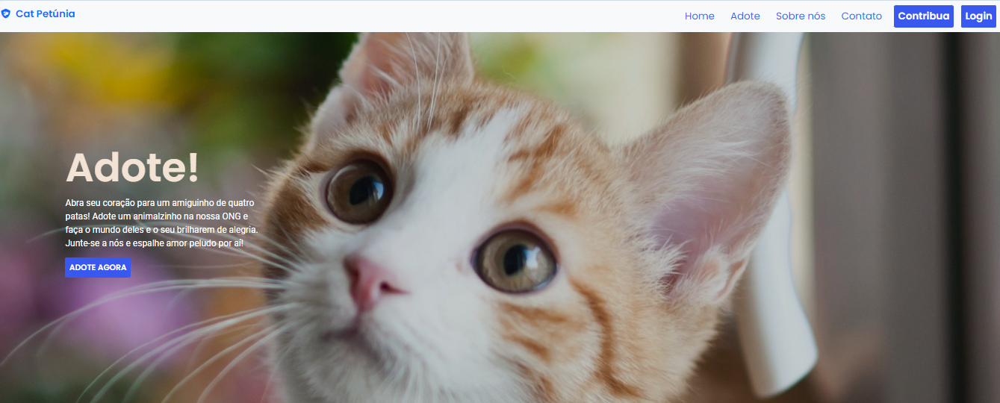

# CatPetunia

Prótotipo do projeto de 2°sem: Desenvolver um site para a causa de uma ONG
Projeto Interdisciplinar do 2°sem de 2023 de Bacharelado em Ciência da Computação da FECAP (Fundação Escola de Comércio Álvares Penteado): desenvolver um site em prol da causa de uma ONG à escolha do grupo, utilizando HTML, CSS , JavaScript e SQL.

## Link para página: 
  <a href="https://mathmoura18.github.io/Projeto-2sem/" target="_blank">https://mathmoura18.github.io/Projeto-2sem/</a>

## Integrantes oficiais: 
  <a href="https://github.com/MathMoura18" target="_blank">Matheus Moura</a>, <a href="https://github.com/yfk7" target="_blank">Yago Kawauchi</a>, <a href="https://github.com/JoaoVitorLB" target="_blank">João Leão Bonifácio</a> e <a href="https://github.com/vitorlocateli" target="_blank">Vitor Locateli</a>.

